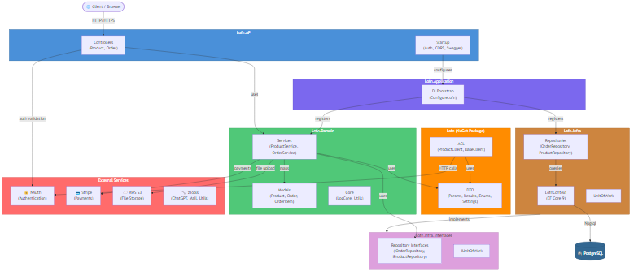

# Lofn - Sales & E-Commerce Platform Backend


## Overview

**Lofn** (MonexUp) is a multi-tenant sales and e-commerce platform backend built with **.NET 8** following **Clean Architecture** principles. It provides RESTful APIs for managing products, orders, and multi-tenant networks with sellers, supporting payment processing via Stripe, file storage with AWS S3, and delegated authentication through NAuth.

The solution is organized into layered projects with clear dependency boundaries, making it suitable for scalable deployments and NuGet package distribution of shared DTOs and ACL clients.

---

## 🚀 Features

- 🏪 **Multi-Tenant Networks** - Support for multiple seller networks with isolated data
- 📦 **Product Management** - Full CRUD with slug generation, image handling, and paged search
- 🛒 **Order Processing** - Order lifecycle management with status tracking and item details
- 💳 **Stripe Integration** - Payment processing with Stripe product/price IDs
- 🔐 **NAuth Authentication** - Delegated Bearer token authentication via custom handler
- ☁️ **AWS S3 Storage** - File upload and image URL resolution
- 🔧 **zTools Integration** - ChatGPT, email sending, document validation utilities
- 📄 **Swagger/OpenAPI** - Auto-generated API documentation
- 🐳 **Docker Support** - Containerized deployment with Dockerfile
- 🏗️ **Clean Architecture** - Strict layered dependency flow with Repository + Unit of Work patterns

---

## 🛠️ Technologies Used

### Core Framework
- **.NET 8** - Backend runtime and SDK
- **ASP.NET Core** - Web API framework

### Database
- **PostgreSQL** - Primary relational database
- **Entity Framework Core 9** - ORM with lazy loading proxies
- **Npgsql** - PostgreSQL provider for EF Core

### Security
- **NAuth** - External authentication service integration
- **Custom RemoteAuthHandler** - Bearer token validation middleware

### Payments & Cloud
- **Stripe.net** - Payment gateway integration
- **AWSSDK.S3** - Amazon S3 file storage
- **SixLabors.ImageSharp** - Image processing

### Additional Libraries
- **Newtonsoft.Json** - JSON serialization
- **NoobsMuc.Coinmarketcap.Client** - Cryptocurrency market data
- **Swashbuckle** - Swagger/OpenAPI documentation

### DevOps
- **Docker** - Containerization
- **GitHub Actions** - CI/CD pipelines (versioning, NuGet publishing, releases)
- **GitVersion** - Semantic versioning from conventional commits

---

## 📁 Project Structure

```
Lofn/
├── Lofn/                        # NuGet package (shared DTOs + ACL)
│   ├── ACL/                     # Anti-Corruption Layer (external API clients)
│   │   ├── Core/                # Base client abstractions
│   │   └── Interfaces/          # Client interfaces
│   └── DTO/                     # Data Transfer Objects
│       ├── Configuration/       # System configuration results
│       ├── Domain/              # Base result types (Status, String, Number)
│       ├── Order/               # Order params, results, enums
│       ├── Product/             # Product params, results, enums
│       └── Settings/            # Application settings (LofnSetting)
├── Lofn.API/                    # Web API entry point
│   └── Controllers/             # REST controllers (Product, Order)
├── Lofn.Application/            # DI bootstrap (ConfigureLofn)
├── Lofn.Domain/                 # Business logic layer
│   ├── Core/                    # Logging, utilities
│   ├── Interfaces/              # Service contracts
│   ├── Models/                  # Domain models
│   └── Services/                # Service implementations
├── Lofn.Infra.Interfaces/       # Infrastructure abstractions
│   └── Repository/              # Repository interfaces
├── Lofn.Infra/                  # Infrastructure implementation
│   ├── Context/                 # EF Core DbContext + entities
│   └── Repository/              # Repository implementations
├── .github/workflows/           # CI/CD (versioning, NuGet, releases)
├── GitVersion.yml               # Semantic versioning config
├── Lofn.sln                     # Solution file
└── README.md                    # This file
```

---

## 🏗️ System Design

The following diagram illustrates the high-level architecture of **Lofn**:



**Dependency flow:** `API → Application → Domain → Infra → PostgreSQL`

- **Lofn.API** receives HTTP requests and delegates to Domain services
- **Lofn.Application** bootstraps all DI registrations via `ConfigureLofn()`
- **Lofn.Domain** contains business rules, service implementations, and domain models
- **Lofn (NuGet)** provides shared DTOs and ACL clients for external consumers
- **Lofn.Infra.Interfaces** defines repository contracts (dependency inversion)
- **Lofn.Infra** implements repositories using EF Core 9 with PostgreSQL

> 📄 **Source:** The editable Mermaid source is available at [`docs/system-design.mmd`](docs/system-design.mmd).

---

## ⚙️ Environment Configuration

Before running the application, configure the settings file:

### 1. Copy the template

```bash
cp Lofn.API/appsettings.Template.json Lofn.API/appsettings.json
```

### 2. Edit `appsettings.json`

```json
{
  "ConnectionStrings": {
    "DefaultConnection": "Host=localhost;Port=5432;Database=lofn;Username=your_user;Password=your_password"
  },
  "LofnSetting": {
    "ApiUrl": "https://localhost:44374",
    "BucketName": "your-s3-bucket"
  },
  "NAuthSetting": {
    "ApiUrl": "https://your-nauth-url/api"
  },
  "zToolsSetting": {
    "ApiUrl": "https://your-ztools-url/api"
  }
}
```

⚠️ **IMPORTANT**:
- Never commit `appsettings.json` with real credentials
- Only `appsettings.Template.json` should be version controlled
- Change all default passwords and connection strings before deployment

---

## 🐳 Docker Setup

### Build and Run

```bash
docker build -t lofn-api -f Lofn.API/Dockerfile .
docker run -p 44374:443 lofn-api
```

### Accessing the Application

| Service | URL |
|---------|-----|
| **Lofn API** | `https://localhost:44374` |
| **Swagger UI** | `https://localhost:44374/swagger` |
| **Health Check** | `https://localhost:44374/` |

---

## 🔧 Manual Setup (Without Docker)

### Prerequisites
- [.NET 8 SDK](https://dotnet.microsoft.com/download/dotnet/8.0)
- [PostgreSQL 16+](https://www.postgresql.org/download/)

### Setup Steps

#### 1. Clone the repository

```bash
git clone https://github.com/emaginebr/Lofn.git
cd Lofn
```

#### 2. Configure environment

```bash
cp Lofn.API/appsettings.Template.json Lofn.API/appsettings.json
# Edit appsettings.json with your database and service credentials
```

#### 3. Build the solution

```bash
dotnet build Lofn.sln
```

#### 4. Run the API

```bash
dotnet run --project Lofn.API
```

The API will be available at `https://localhost:44374`.

---

## 📚 API Documentation

### Authentication Flow

```
1. Client sends Bearer token → 2. RemoteAuthHandler validates via NAuth → 3. Session established → 4. Endpoints authorize
```

### Key Endpoints

| Method | Endpoint | Description | Auth |
|--------|----------|-------------|------|
| POST | `/product/insert` | Create a new product | Yes |
| POST | `/product/update` | Update an existing product | Yes |
| POST | `/product/search` | Search products (paged) | No |
| GET | `/product/getById/{id}` | Get product by ID | Yes |
| GET | `/product/getBySlug/{slug}` | Get product by slug | No |
| POST | `/order/update` | Update order status | Yes |
| POST | `/order/search` | Search orders (paged) | Yes |
| POST | `/order/list` | List orders with details | Yes |
| GET | `/order/getById/{id}` | Get order by ID | Yes |

> Full interactive documentation available at `/swagger` when running the API.

---

## 🔄 CI/CD

### GitHub Actions

The project uses three automated workflows:

| Workflow | Trigger | Description |
|----------|---------|-------------|
| **Version & Tag** | Push to `main` | Creates semantic version tags using GitVersion |
| **Create Release** | After version tag | Creates GitHub releases for minor/major versions |
| **Publish NuGet** | After version tag | Builds and publishes the Lofn NuGet package |

**Versioning strategy** (GitVersion - ContinuousDelivery):
- `feat:` / `feature:` → Minor version bump
- `fix:` / `patch:` → Patch version bump
- `breaking:` / `major:` → Major version bump

---

## 🔒 Security Features

### Authentication
- **Bearer Token** - All protected endpoints require a valid Bearer token
- **Remote Validation** - Tokens are validated against the NAuth external service
- **Session Management** - User context (userId, session) maintained per request

### Infrastructure
- **HTTPS** - Kestrel configured with X509 certificate in production
- **CORS** - Configurable cross-origin resource sharing
- **Input Validation** - Request parameter validation at controller level

---

## 🚀 Deployment

### Development

```bash
dotnet run --project Lofn.API
```

### Production

```bash
dotnet publish Lofn.API -c Release -o ./publish
dotnet ./publish/Lofn.API.dll
```

---

## 🤝 Contributing

Contributions are welcome! Please feel free to submit a Pull Request.

### Development Setup

1. Fork the repository
2. Create a feature branch (`git checkout -b feature/AmazingFeature`)
3. Make your changes
4. Build the solution (`dotnet build Lofn.sln`)
5. Commit your changes using conventional commits (`git commit -m 'feat: add some AmazingFeature'`)
6. Push to the branch (`git push origin feature/AmazingFeature`)
7. Open a Pull Request

### Coding Standards

- Follow Clean Architecture dependency rules
- Use conventional commits for semantic versioning
- All new endpoints must include authorization where appropriate
- Repository pattern for all data access

---

## 👨‍💻 Author

Developed by **[Rodrigo Landim Carneiro](https://github.com/landim32)**

---

## 📄 License

This project is licensed under the **MIT License** - see the [LICENSE](LICENSE) file for details.

---

## 🙏 Acknowledgments

- Built with [.NET 8](https://dotnet.microsoft.com/)
- Database powered by [PostgreSQL](https://www.postgresql.org/)
- ORM by [Entity Framework Core](https://docs.microsoft.com/ef/core/)
- Payments by [Stripe](https://stripe.com/)
- Image processing by [SixLabors ImageSharp](https://sixlabors.com/products/imagesharp/)

---

## 📞 Support

- **Issues**: [GitHub Issues](https://github.com/emaginebr/Lofn/issues)
- **Discussions**: [GitHub Discussions](https://github.com/emaginebr/Lofn/discussions)

---

**⭐ If you find this project useful, please consider giving it a star!**
